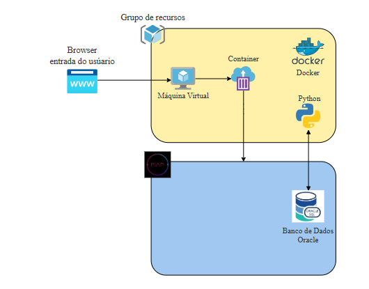

# Projeto Flask + MySQL com Docker Compose

Este repositório contém uma aplicação **Flask** com **CRUD completo** integrada ao **MySQL**, pronta para rodar em uma VM Linux sem interface gráfica utilizando **Docker Compose**.

> Arquivos principais:
>
> - `docker-compose.yml` — orquestra serviços (db + app)
> - `app/` — Dockerfile, `requirements.txt` e `app.py` (API Flask)
> - `db/init.sql` — (opcional) script de inicialização do MySQL
>
---

### Requisito

### Arquitetura atual


### Arquitetura futura


## Análise da Arquitetura (resumo)

- **Serviços do projeto:**
  - `app` — API Flask (CRUD completo)
  - `db` — MySQL (persistência)

- **Dependências:**
  - `app` depende do `db` para operações CRUD.
  - Orquestração via Docker Compose (`depends_on` + healthcheck).

- **Estratégia de containerização:**
  - `db`: imagem oficial `mysql:8.x`, volume para persistência e script de inicialização (`/docker-entrypoint-initdb.d/init.sql`).
  - `app`: imagem baseada em `python:3.11-slim`, instalar bibliotecas via `requirements.txt`, rodar `app.py` como usuário não-root.

---

## Implementação Docker Compose 

Itens aplicados no projeto:
- **Definição dos serviços:** `db` (MySQL) e `app` (Flask).
- **Redes:** rede Docker bridge interna para comunicação segura entre `app` e `db`.
- **Volumes:** volume dedicado para persistência do MySQL (`db_data`).
- **Variáveis de ambiente:** configuráveis no `docker-compose.yml` (usuário, senha, database).
- **Políticas de restart:** `db` com `restart: always`; `app` com `restart: on-failure`.
- **Exposição de portas:** 3306 para MySQL (opcional), 5000 para a API.
- **Health checks:** configurado para MySQL (mysqladmin ping).
- **Usuário não-root:** `app` roda como `user: "1000:1000"`.

---

## Documentação Técnica (README + comandos + deploy + troubleshooting)

### Estrutura de pastas recomendada

```
project/
 ├─ docker-compose.yml
 ├─ README.md
 ├─ db/
 │  └─ init.sql
 └─ app/
    ├─ Dockerfile
    ├─ requirements.txt
    └─ app.py
```

### Comandos essenciais

```bash
# Subir serviços
docker compose up -d --build

# Ver status dos containers
docker compose ps

docker ps

# Ver logs
docker compose logs -f app

docker compose logs -f db

# Parar e remover
docker compose down
# Parar e remover com volumes (apaga dados do db):
docker compose down -v
```

### Processo de Deploy 

1. Na VM, instale Docker (ex.: AlmaLinux usa `dnf`):
   ```bash
   sudo dnf update -y
   sudo dnf -y install dnf-plugins-core
   sudo dnf config-manager --add-repo https://download.docker.com/linux/centos/docker-ce.repo
   sudo dnf install docker-ce docker-ce-cli containerd.io docker-buildx-plugin docker-compose-plugin -y
   sudo systemctl enable --now docker
   sudo usermod -aG docker $USER  # opcional: logout/login
   ```

2. Criar a estrutura do projeto e salvar os arquivos (`docker-compose.yml`, `db/init.sql`, `app/*`).

3. Subir:
   ```bash
   cd ~/project
   docker compose up -d --build
   ```

4. Aguardar `db` ficar *healthy* e testar CRUD através do terminal do python.

Comando para acessar python:
```bash
   docker compose run --rm app python3 main.py
   ```


### Ver operações diretamente no banco (evidência)

```bash
docker exec -it mysql_container mysql -umeu_usuario -pminha_senha meu_banco
# No prompt MySQL:
SELECT * FROM pessoas LIMIT 10;
```

### Troubleshooting básico
- **Init.sql não executou**: provavelmente o volume `db_data` já existia. Faça `docker compose down -v` e suba novamente.
- **DB não fica healthy**: ver `docker compose logs db` e validar variáveis de ambiente/credenciais.
- **App não conecta**: checar `DB_HOST` (deve ser `db`), e se o MySQL aceitou o usuário e senha.

---


